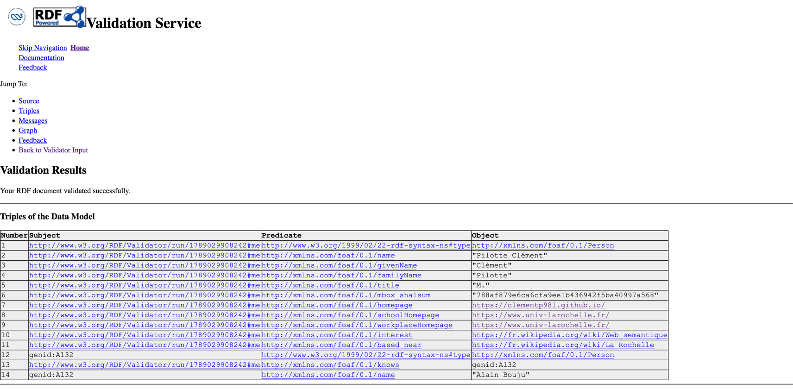

# Compte-rendu - FOAF (Friend Of A Friend) - PILOTTE Clément

## Exercice 1

### Objectif

Se décrire pour le Web sémantique en publiant un fichier RDF (`foaf.rdf`),
relié a une page de presentation (`index.html`), le tout hebergé sur GitHub Pages.

### Ce qui a été fait

1. Rédaction du fichier `foaf.rdf` au format RDF/XML avec plusieurs éléments de
   vocabulaire FOAF vu durant le CM.
   (name, givenName, familyName, homepage, interest, knows, based_near...).
2. Création de la page `index.html` qui référence le fichier FOAF dans son en-tete :

   ```html
   <link rel="meta" type="application/rdf+xml" title="FOAF" href="https://github.com/clementp981/clementp981.github.io/blob/main/foaf.rdf">
   ```

3. Dépôt des deux fichiers sur un dépôt GitHub nomme `https://clementp981.github.io/`,
   ce qui active automatiquement GitHub Pages.
4. Mise en ligne : la page est accessible sur `https://clementp981.github.io/`
   et le fichier FOAF sur `https://github.com/clementp981/clementp981.github.io/blob/main/foaf.rdf`.
5. Validation du fichier avec le validateur RDF du W3C
   (`https://www.w3.org/RDF/Validator/`), qui extrait correctement les triplets.

   

### Points relevés/appris

- **mbox_sha1sum** : l'adresse mail n'est pas écrite en clair mais sous forme
  d'empreinte sha1 de l'URI `mailto:...`. Cela évite le ramassage automatique
  de l'adresse par des robots.
- **knows et rdfs:seeAlso** : la propriete `knows` relie deux personnes, et
  `rdfs:seeAlso` indique ou trouver le fichier FOAF de l'autre personne. C'est
  ce qui permet a un crawler de suivre les liens d'un profil a l'autre.


## Exercice 2

### Objectif

Créer un compte ORCID, puis utiliser `curl` pour récupérer les métadonnées
du profil, en particulier les éléments exprimés avec le vocabulaire FOAF.

## Ce qui a été fait

1. Création d'un compte sur https://orcid.org/ et obtention d'un identifiant
   ORCID à 16 chiffres.
2. Récupération du profil au format FOAF/Turtle,
   en précisant l'en-tête `Accept` dans la requête `curl`.

## Commande utilisée

```bash
curl -L -H "Accept: text/turtle" https://orcid.org/0009-0003-8347-9730
```

- `-L` suit les redirections d'ORCID.
- `-H "Accept: text/turtle"` demande le format Turtle. Sans cet en-tête,
  ORCID renvoie du XML par défaut.

## Points relevés/appris

- **Négociation de contenu** : une même URI d'identifiant ORCID peut renvoyer
  plusieurs représentations (Turtle, RDF/XML, JSON-LD, XML, JSON) selon
  l'en-tête `Accept`. C'est le serveur qui choisit la version adaptée.
- **Éléments FOAF** : la sortie Turtle déclare le préfixe
  `foaf: <http://xmlns.com/foaf/0.1/>` et décrit le nom et le prénom avec
  `foaf:givenName` et `foaf:familyName`. Le reste du profil utilise
  d'autres vocabulaires (prov, pav), ce qui illustre le mélange de
  vocabulaires autour d'un même sujet.

## Résultat

<!-- Colle ci-dessous la sortie de la commande curl -->

```turtle
@prefix foaf: <http://xmlns.com/foaf/0.1/> .
@prefix gn:   <http://www.geonames.org/ontology#> .
@prefix owl:  <http://www.w3.org/2002/07/owl#> .
@prefix pav:  <http://purl.org/pav/> .
@prefix prov: <http://www.w3.org/ns/prov#> .
@prefix rdf:  <http://www.w3.org/1999/02/22-rdf-syntax-ns#> .
@prefix rdfs: <http://www.w3.org/2000/01/rdf-schema#> .
@prefix xsd:  <http://www.w3.org/2001/XMLSchema#> .

<https://pub.orcid.org/orcid-pub-web/experimental_rdf_v1/0009-0003-8347-9730>
        rdf:type              foaf:PersonalProfileDocument ;
        pav:createdBy         <https://orcid.org/0009-0003-8347-9730> ;
        pav:createdOn         "2026-09-10T08:09:16.947Z"^^xsd:dateTime ;
        pav:createdWith       <https://orcid.org> ;
        pav:lastUpdateOn      "2026-09-10T08:48:29.363Z"^^xsd:dateTime ;
        prov:generatedAtTime  "2026-09-10T08:48:29.363Z"^^xsd:dateTime ;
        prov:wasAttributedTo  <https://orcid.org/0009-0003-8347-9730> ;
        foaf:maker            <https://orcid.org/0009-0003-8347-9730> ;
        foaf:primaryTopic     <https://orcid.org/0009-0003-8347-9730> .

<https://orcid.org/0009-0003-8347-9730#orcid-id>
        rdf:type                     foaf:OnlineAccount ;
        rdfs:label                   "0009-0003-8347-9730" ;
        foaf:accountName             "0009-0003-8347-9730" ;
        foaf:accountServiceHomepage  <https://orcid.org> .

<https://orcid.org/0009-0003-8347-9730#workspace-works>
        rdf:type  foaf:Document .

<https://orcid.org/0009-0003-8347-9730>
        rdf:type           prov:Person , foaf:Person ;
        rdfs:label         "Clément Pilotte" ;
        foaf:account       <https://orcid.org/0009-0003-8347-9730#orcid-id> ;
        foaf:familyName    "Pilotte" ;
        foaf:givenName     "Clément" ;
        foaf:publications  <https://orcid.org/0009-0003-8347-9730#workspace-works> .
```

## Exercice 3

### Objectif